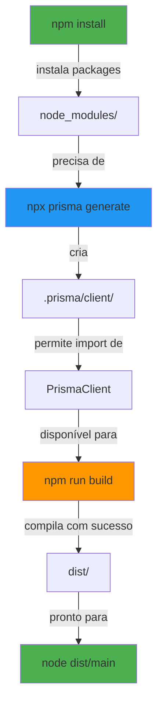

# Análise Visual dos Problemas e Soluções

## 🔄 Fluxo Comparativo: Windows vs Linux (Render)

```
┌─────────────────────────────────────────────────────┐
│            DESENVOLVIMENTO LOCAL (Windows)          │
├─────────────────────────────────────────────────────┤
│                                                      │
│  npm install                                        │
│      ↓                                               │
│  └─→ node_modules criado                           │
│      └─→ Prisma gerado automaticamente             │
│      └─→ .prisma/client criada                     │
│                                                      │
│  npm run build                                      │
│      ↓                                               │
│  └─→ TypeScript compilado                          │
│  └─→ Builds case-insensitive: ✅                   │
│      uploads/ = Uploads/ = UPLOADS/                │
│                                                      │
│  Resultado: ✅ Build bem-sucedido (Windows)        │
│                                                      │
└─────────────────────────────────────────────────────┘


┌─────────────────────────────────────────────────────┐
│           DEPLOYMENT RENDER (Linux)                 │
├─────────────────────────────────────────────────────┤
│                                                      │
│  npm install                                        │
│      ↓                                               │
│  ❌ Prisma NÃO é gerado automaticamente            │
│  ❌ .prisma/client NÃO é criada                    │
│                                                      │
│  npm run build (SEM prisma generate)                │
│      ↓                                               │
│  ❌ Erro TS2305: PrismaClient not exported         │
│      └─→ porque não foi gerado!                   │
│                                                      │
│  Além disso:                                        │
│  ❌ Case-sensitive: ✗                              │
│     uploads/ ≠ Uploads/                            │
│     Erro TS2307: Module not found                  │
│                                                      │
│  Resultado: ❌ Build falha em Linux (Render)       │
│                                                      │
└─────────────────────────────────────────────────────┘
```

---

## 🔧 Solução: Build Command Correto

```
┌─────────────────────────────────────────────────────┐
│  npm install && npx prisma generate && npm run build│
├─────────────────────────────────────────────────────┤
│                                                      │
│  Passo 1: npm install                              │
│  └─→ Instala packages em node_modules/             │
│                                                      │
│  Passo 2: npx prisma generate ⭐                   │
│  └─→ Gera .prisma/client/                          │
│  └─→ Cria Prisma Client types                      │
│  └─→ Função de @prisma/client disponível           │
│                                                      │
│  Passo 3: npm run build                            │
│  └─→ TypeScript compila com sucesso               │
│  └─→ Todos imports encontrados (case-correct)      │
│                                                      │
│  Resultado: ✅ Build sucesso em Linux (Render)    │
│                                                      │
└─────────────────────────────────────────────────────┘
```

---

## 📊 Problema 1: PrismaClient Generation

### Diagrama do Problema

```
@prisma/client package
    ↓
    └─→ src/index.ts
        └─→ export { PrismaClient } (gerado)
            
⚠️  GERAÇÃO ACONTECE QUANDO?
    
    Windows:
    ✅ npm install → automaticamente gera (está em cache local ou anterior)
    
    Render:
    ❌ npm install → NÃO gera (ambiente limpo)
    ✅ npx prisma generate → GERA (explícitamente)
```

### Timeline do Erro

```
Render Build Timeline:

1. npm install                           ← Instala packages
2. npm run build                         ← Compila TypeScript
   └─→ import { PrismaClient } from "@prisma/client"
       └─→ Procura em node_modules/@prisma/client/
           └─→ NÃO encontra (não foi gerado!)
               ❌ error TS2305: Member not exported

SOLUÇÃO: Adicionar npx prisma generate ANTES de npm run build

1. npm install                           ← Instala packages
2. npx prisma generate                   ← ⭐ GERA Prisma Client
3. npm run build                         ← Compila TypeScript
   └─→ import { PrismaClient } from "@prisma/client"
       └─→ Procura em node_modules/@prisma/client/
           └─→ ✅ ENCONTRA (foi gerado no step 2!)
               ✅ Compilação sucesso
```

---

## 🔤 Problema 2: Case Sensitivity em Linux

### Sistema de Ficheiros

```
Windows File System (NTFS):
├─ uploads/
├─ Uploads/
├─ UPLOADS/
└─→ Todos são IGUAIS! ✅ uploads === Uploads === UPLOADS

Linux File System (ext4):
├─ uploads/
├─ Uploads/
├─ UPLOADS/
└─→ Todos são DIFERENTES! ❌ uploads ≠ Uploads ≠ UPLOADS
```

### Exemplo Prático no Código

```typescript
// Arquivo REAL existe:
// src/modules/uploads/uploads.module.ts
//                      ↑ minúscula

// Import CORRETO (Windows e Linux):
import { UploadsModule } from '../uploads/uploads.module';  ✅

// Import INCORRETO (funciona Windows, quebra Linux):
import { UploadsModule } from '../Uploads/uploads.module';  ❌
// Procura: ../Uploads/ (maiúscula)
// Encontra: ../uploads/ (minúscula)
// Resultado: ❌ ENOENT: no such file or directory
```

### Detection Tool

```bash
# Verificar case sensitivity no seu filesystem Windows
# (vai achar o arquivo mesmo com case errado):
dir /s Uploads\*.module.ts     ✅ Encontra mesmo se for uploads/

# Simular Linux (case-sensitive):
# Apenas encontra com case correto:
find . -path "./uploads/uploads.module.ts"  ✅
find . -path "./Uploads/uploads.module.ts"  ❌ Não encontra
```

---

## 📈 Impacto de Cada Änderung

### Adição 1: Atualizar package.json

```json
{
  "scripts": {
    "prisma:generate": "prisma generate",
    "prisma:db:push": "prisma db push --skip-generate",
    "prisma:migrate": "prisma migrate deploy"
  }
}
```

**Impacto:**
- ✅ Permite rodar manualmente: `npm run prisma:generate`
- ✅ Facilita migrations: `npm run prisma:migrate`
- ✅ Reutilizável em CI/CD

---

### Adição 2: tsconfig.json - forceConsistentCasingInFileNames

```json
{
  "compilerOptions": {
    "forceConsistentCasingInFileNames": true
  }
}
```

**Impacto:**
- ✅ TypeScript avisa se import tem case errado
- ✅ Windows mostrará erro também (mesmo sendo permissivo)
- ✅ Evita surpresas em deploy

**Exemplo com a flag:**
```typescript
// arquivo: src/modules/uploads/uploads.module.ts
import { X } from '../Uploads/uploads.module';  // ← TypeScript erro aqui!
// error TS1149: File name differs from already included file name
```

---

### Remoção: Deletar prisma.config.ts

```typescript
// ❌ REMOVER ESTE ARQUIVO
// src/prisma.config.ts (ou backend/prisma.config.ts)

// Razão 1: Não é parte do Prisma schema oficial
// Razão 2: Prisma usa apenas prisma/schema.prisma
// Razão 3: Pode causar conflitos de configuração
```

**Impacto:**
- ✅ Evita conflitos de config
- ✅ Usa apenas prisma/schema.prisma (padrão)
- ✅ Build mais limpo

---

## 🔍 Estrutura Prisma Correta

```
backend/
├── prisma/
│   ├── schema.prisma        ✅ ARQUIVO PRINCIPAL
│   ├── migrations/
│   │   └── (histórico)
│   └── seed.ts (opcional)
│
├── src/
│   └── config/
│       └── database.config.ts
│
└── prisma.config.ts        ❌ REMOVER
```

---

## 🚀 Sequência de Build Correta



---

## ⚡ Antes vs Depois

### ❌ ANTES (Quebrava em Render)

```bash
# Build Command
npm install && npm run build

# Resultado
error TS2305: Module '"@prisma/client"' has no exported member 'PrismaClient'
error TS2307: Cannot find module './modules/uploads/uploads.module'
```

**Por quê:**
- Prisma não foi gerado
- Imports com case errado

---

### ✅ DEPOIS (Funciona em Render)

```bash
# Build Command
npm install && npx prisma generate && npm run build

# Resultado
✅ Generated Prisma Client
✅ Successfully compiled 150 files
```

**Por quê:**
- Prisma é gerado explicitamente
- Imports case-corretos verificados na compilação

---

## 📊 Teste Comparativo

### Teste Local (Windows)

```bash
$ npm run build
✓ Compila (Prisma foi gerado antes)
✓ Case-insensitive funciona

Resultado: ✅ Sucesso
```

### Teste no Render (Linux) - ANTES

```bash
$ npm install && npm run build
✗ Erro TS2305: PrismaClient not exported
✗ Case-sensitive falha no uploads

Resultado: ❌ Falha
```

### Teste no Render (Linux) - DEPOIS

```bash
$ npm install && npx prisma generate && npm run build
✓ Prisma gerado
✓ Case correto validado
✓ Compila com sucesso

Resultado: ✅ Sucesso
```

---

## 🔗 Relacionamentos Entre os Problemas

```
┌─────────────────────────────────────────┐
│   Problema Raiz: Diferenças             │
│   Windows vs Linux Environment          │
└─────────────────────────────────────────┘
                   ↓
        ┌──────────┴──────────┐
        ↓                     ↓
    ❌ Auto-generation     ❌ Case Sensitivity
       vs Require            Windows ≠ Linux
       Explicit
        ↓                     ↓
   ┌────────────┐        ┌─────────────┐
   │ Solução:   │        │ Solução:    │
   │ Generate   │        │ Verify      │
   │ Explicitly │        │ Case in     │
   │            │        │ Imports     │
   │npx prisma  │        │             │
   │generate    │        │forceConsistent
   │            │        │CasingInFiles│
   └────────────┘        └─────────────┘
        ↓                     ↓
        └──────────┬──────────┘
                   ↓
        ✅ Build Sucesso
           Both Windows & Linux
```

---

**Criado:** 2026-02-19  
**Tipo:** Análise Técnica e Visual  
**Público:** Desenvolvedores NestJS/Render
